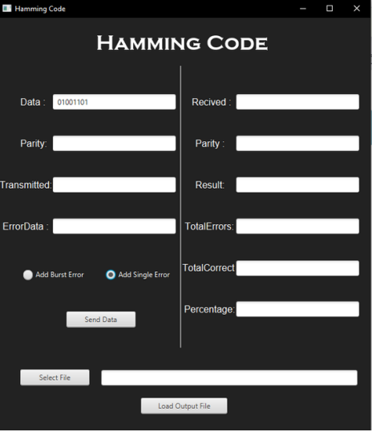
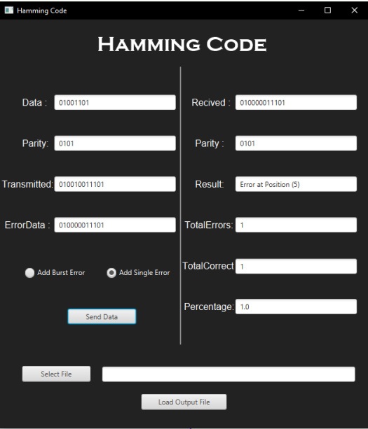
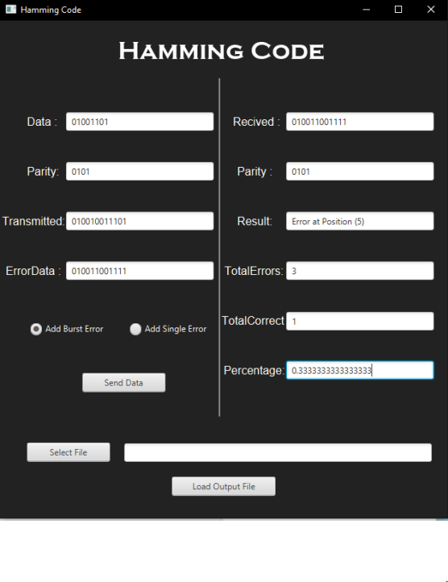
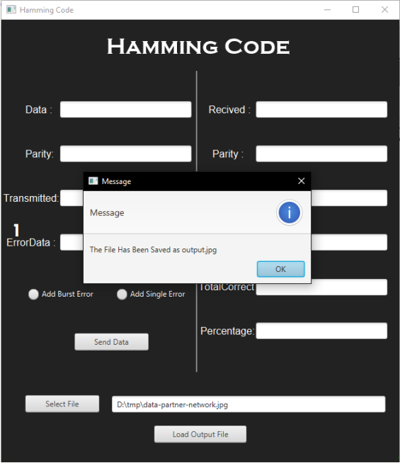
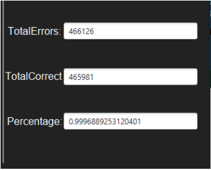
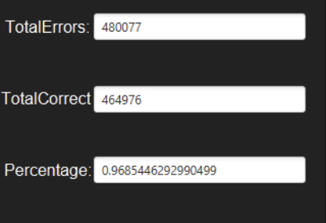

# Hamming Code Project

Hamming code is a type of error-correcting code used in digital
communication and information storage. It was developed by Richard
Hamming in 1950 and is named after him. The primary purpose of Hamming
codes is to detect and correct errors that can occur during the
transmission or storage of data.

Hamming codes are like digital detectives that find and fix mistakes in
computer data. They use extra bits (parities) to check for errors and make
sure information is correct. By comparing received and expected codes,
called syndromes, they can spot and correct mistakes. Hamming codes are
crucial for making sure digital systems, like computers and communication
devices, work reliably. They help a lot in tasks where getting information
right is really important, such as sending messages or storing data in
computers.

## Project Description

The project is a Java program that consists of two sections. The first
section allows the user to enter a single byte, word, or double word and
introduce random single or burst errors, which can then be corrected. The
percentage of corrected errors can also be calculated.

The second section involves reading from a file, image, video, etc. The
program adds both single and burst errors to the data and attempts to
correct them using Hamming code. The percentage of corrected errors is
then calculated.

## Tools Used

- JAVA
- JavaFX for GUI
- CSS

## Procedure & Results

### Part One : Manual Data

- First thing we need to input Data with Adding Random
  Single Error, For Ex : 01001101
  

- Second Thing we want to press on button “Send Data” Reciver and see the result of parity bit,transmitte Data, Received Data With error and corrected data, Percentage of correcting errors

- Repeat the same thing but with burst errors.

### Part Two : Loading a file

- First things first , let’s try to load a photo and see the
  results if we put small ratio of burst errors (most of errors
  are single)

- now if we pressed at button “Load Output File” , the java
  program will take a bit of time and once it finishes the output
  photo will be generated with error correction percentage ,
  number of errors introduced and corrected.

- notice how the output image has been changed (some
  noise added to it because of random errors) .also , see the
  percentage of correcting erros it’s 99.9%

- Now, we want to increase the burst error ratio and
  observe the difference. So, we will repeat all the steps
  with only one change, which is the increased ratio.

## Conclusion

in conclusion , The Hamming code is a powerful
technique used in digital transmission for detecting and
correcting errors. It utilizes parity bit checkers to
accomplish this task effectively.
we conclude , It seems like the Hamming Code is only
capable of correcting single errors but not burst
errors.

As we have seen in the previous steps,
increasing the ratio of burst errors led to a higher
number of errors that were not corrected. Therefore, it
is safe to conclude that Hamming Code is only suitable
for single error correction.
